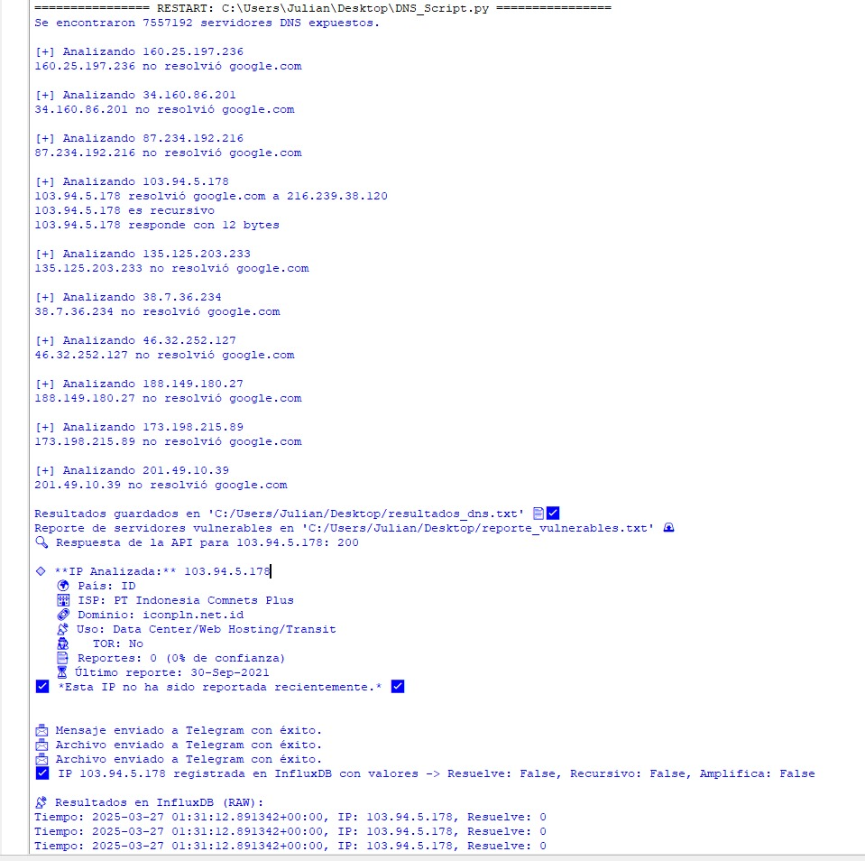
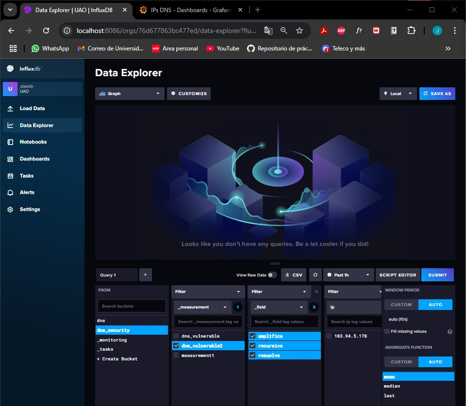
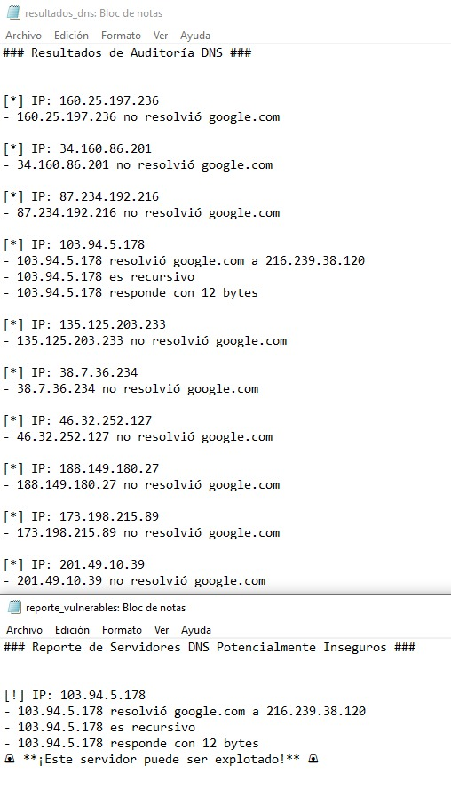
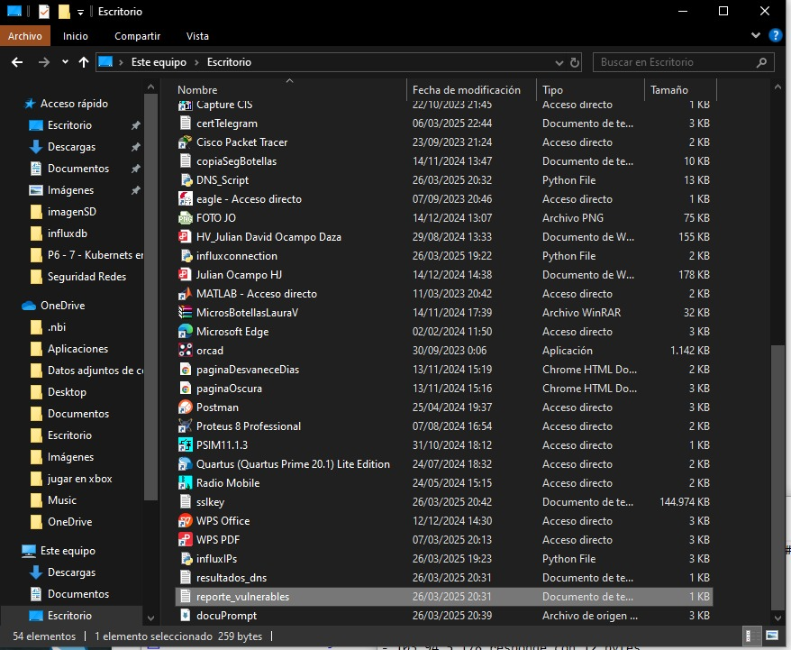
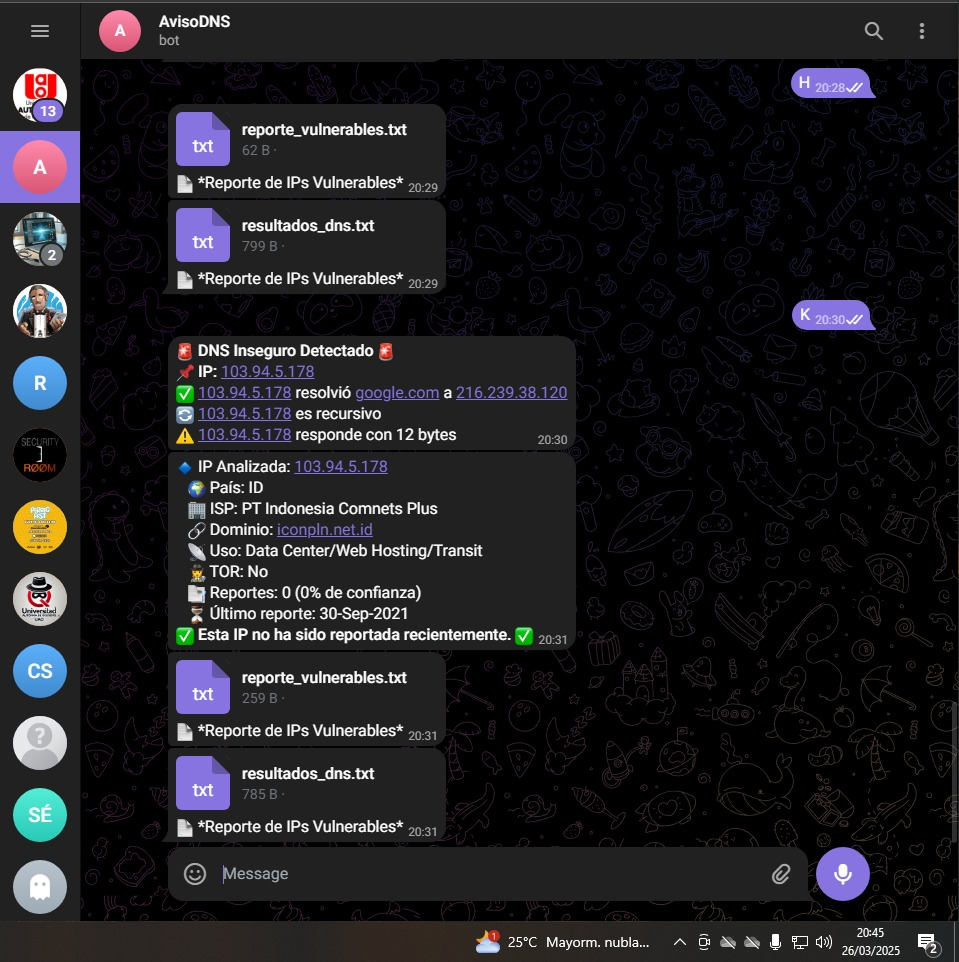
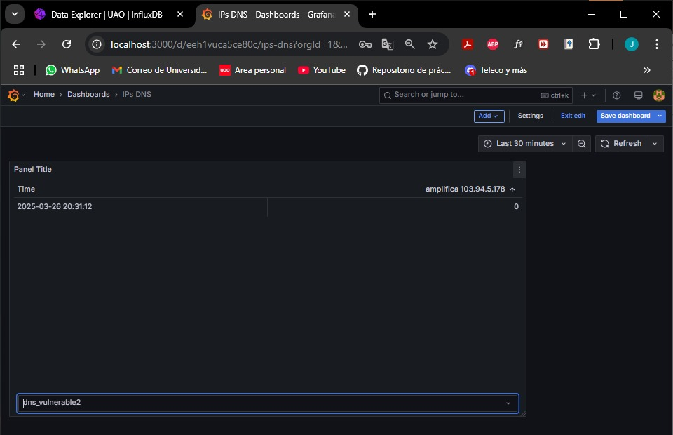
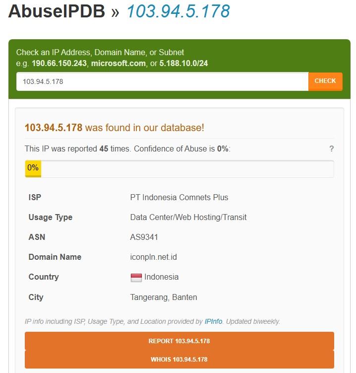
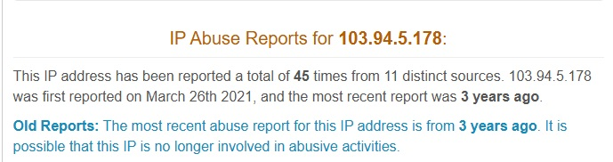

# Manual de Usuario - Auditoría DNS con Shodan y Telegram
## Código principal: DNS_Script.py

## 1. Introducción

Este software permite auditar servidores DNS expuestos en Shodan, verificando si permiten recursividad o amplificación, notificando sobre vulnerabilidades mediante Telegram sin antes pasar por la pagina "https://www.abuseipdb.com/" y almacenando datos en InfluxDB para luego observarlos en Grafana.

## 2. Requisitos Previos

* Tener una cuenta en Shodan con una API Key activa.
* Un bot de Telegram con su token de acceso.
* Un servidor con InfluxDB instalado.
* Python 3.x con las siguientes librerías instaladas:
```
pip install shodan dnspython requests influxdb-client
```
## 3. Configuración

- 3.1. Configurar las Credenciales

Antes de ejecutar el script, edite las siguientes variables con sus credenciales:

* SHODAN_API_KEY = "SU_API_KEY"
* TELEGRAM_BOT_TOKEN = "SU_TELEGRAM_TOKEN"
* CHAT_ID = "SU_CHAT_ID"
* INFLUXDB_URL = "http://localhost:8086"
* INFLUXDB_TOKEN = "SU_INFLUXDB_TOKEN"
* INFLUXDB_ORG = "SU_ORG"
* INFLUXDB_BUCKET = "SU_BUCKET"

## 4. Ejecución del Script

Para iniciar la auditoría, simplemente ejecute:
```
python script_dns_audit.py
```
El script realizará las siguientes acciones:
1. Buscará servidores DNS abiertos en Shodan.
2. Verificará si pueden resolver dominios.
3. Analizará si permiten recursividad.
4. Detectará posible amplificación.
5. Notificará por Telegram si un servidor es vulnerable.
6. Almacenará los resultados en InfluxDB.
7. Generará un reporte de IPs vulnerables en archivos locales.

## 5. Resultados y Reportes

* Archivos Generados:
```
- resultados_dns.txt: Contiene los resultados de la auditoría.
- reporte_vulnerables.txt: IPs detectadas con vulnerabilidades.
```
* Notificaciones:
```
- Telegram recibe alertas con detalles de las IPs vulnerables segun https://www.abuseipdb.com/.
```
Base de Datos:
```
- Los datos se almacenan en InfluxDB y pueden ser visualizados en herramientas como Grafana.
```
## 6. ¡¡¡SEGURIDAD Y RECOMENDACIONES!!!

## Uso Responsable: No utilice este script sin autorización.
## Límites de Shodan: Respete los límites de API y evite bloqueos.
## Protección de Datos: No comparta su API Key ni credenciales.
## REALICE ESTA PRÁCTICA CON FINES EDUCATIVOS Y DE ENTENDIMIENTO, LA RAZON DE ESTE SCRIPT ES PODER BLOQUEAR SI LAS IPS OBTENIDAS LLEGAN A GENERAR COMPLICACIONES.


# Explicación del Código

## 1. Configuración e Importaciones

Se importan las bibliotecas necesarias, incluyendo:

* shodan → Para buscar servidores DNS en Shodan.
* dns.resolver → Para consultar la resolución de dominios.
* socket → Para comunicación de red (detectar amplificación).
* requests → Para interactuar con la API de Telegram y AbuseIPDB.
* influxdb_client → Para almacenar resultados en InfluxDB.
* os, time, re, datetime → Funciones del sistema y manejo de tiempo.

## 2. Configuración de APIs

Aquí se definen las claves de API para:

* Shodan → Buscar servidores DNS expuestos.
* Telegram → Enviar notificaciones de DNS vulnerables.
* InfluxDB → Almacenar datos de servidores DNS.
* AbuseIPDB → Revisar historial de reportes de IPs.
```
SHODAN_API_KEY = "OscSR1MKM2fICcN5KgVBBJIGnXwrIt8z"
api = shodan.Shodan(SHODAN_API_KEY)

TELEGRAM_BOT_TOKEN = "XXXXXXXXXXXXXXX"
CHAT_ID = "XXXXXXXXXXXXXXXX"

ABUSEIPDB_API_KEY = "XXXXXXXXXXXXXXXXXXXXXXXXXXXXXXXXXXXXX"

INFLUXDB_URL = "http://localhost:8086"
INFLUXDB_TOKEN = "XXXXXXXXXXXXXXXXXXXXXXXXXXXXXXXXXXXXX"
INFLUXDB_ORG = "UAO"
INFLUXDB_BUCKET = "dns_security"
```

## 3. Búsqueda de Servidores DNS en Shodan

Busca servidores en Shodan con el puerto 53 abierto y devuelve sus IPs:
```
def buscar_dns_expuestos():
    try:
        resultados = api.search("port:53")
        print(f"Se encontraron {resultados['total']} servidores DNS expuestos.")
        return [match['ip_str'] for match in resultados['matches']]
    except shodan.APIError as e:
        print(f"Error en Shodan: {e}")
        return []

```
## 4. Verificación de Resolución(Verificar si un servidor DNS resuelve dominios)

Comprueba si el DNS responde consultas. Se consulta google.com para verificar si el servidor responde:
```
def verificar_resolucion_dns(ip, dominio="google.com"):
    try:
        resolver = dns.resolver.Resolver()
        resolver.nameservers = [ip]
        respuesta = resolver.resolve(dominio, "A")
        return True, f"{ip} resolvió {dominio} a {', '.join([r.to_text() for r in respuesta])}"
    except Exception:
        return False, f"{ip} no resolvió {dominio}"

```
## 5. Detección de Recursividad y Amplificación

Se verifica si el servidor permite consultas recursivas o genera respuestas anormalmente grandes.
Un servidor DNS recursivo puede ser explotado para ataques de amplificación.
Un servidor que responde con paquetes grandes puede ser usado en ataques de DDoS.:
```
def verificar_recursividad(ip):
    try:
        resolver = dns.resolver.Resolver()
        resolver.nameservers = [ip]
        resolver.use_edns(0, dns.flags.RD)  # Solicitar recursión
        resolver.resolve("example.com", "A")
        return True, f"{ip} es recursivo"
    except dns.resolver.NoAnswer:
        return False, f"{ip} no permite recursión"
    except Exception:
        return False, f"Error verificando recursividad en {ip}"

def detectar_amplificacion(ip):
    try:
        consulta = b'\x00\x00\x10\x00\x00\x01\x00\x00\x00\x00\x00\x00\x07example\x03com\x00\x00\xFF\x00\x01'
        familia = socket.AF_INET6 if ":" in ip else socket.AF_INET
        sock = socket.socket(familia, socket.SOCK_DGRAM)
        sock.settimeout(2)
        sock.sendto(consulta, (ip, 53))
        respuesta, _ = sock.recvfrom(512)
        size = len(respuesta)
        if size > 150:
            return True, f"{ip} responde con {size} bytes [POTENCIAL AMPLIFICACIÓN]"
        else:
            return False, f"{ip} responde con {size} bytes"
    except socket.timeout:
        return False, f"{ip} no respondió."
    except Exception:
        return False, f"Error en {ip} al analizar amplificación."

```



## 6. Enviar alerta a Telegram

Si un servidor es recursivo o amplifica, se envía un mensaje a Telegram.:
```
def enviar_alerta_telegram(ip, resolucion, recursividad, amplificacion):
    mensaje = f"🚨 *DNS Inseguro Detectado* 🚨\n📌 *IP:* {ip}\n"
    mensaje += f"✅ {resolucion}\n" if resolucion else f"❌ {ip} no resolvió google.com\n"
    mensaje += f"🔄 {recursividad}\n" if recursividad else f"🔒 {ip} no permite recursión\n"
    mensaje += f"⚠️ {amplificacion}\n" if amplificacion else f"🛑 {ip} no mostró signos de amplificación\n"

    url = f"https://api.telegram.org/bot{TELEGRAM_BOT_TOKEN}/sendMessage"
    payload = {"chat_id": CHAT_ID, "text": mensaje, "parse_mode": "Markdown"}
    requests.post(url, data=payload)

```


## 7. Verificar IPs en AbuseIPDB

Revisa si una IP ha sido reportada en el último año:
```
def verificar_ip_abuseipdb(ip):
    url = "https://api.abuseipdb.com/api/v2/check"
    headers = {"Key": ABUSEIPDB_API_KEY, "Accept": "application/json"}
    params = {"ipAddress": ip, "maxAgeInDays": "365"}

    response = requests.get(url, headers=headers, params=params)
    data = response.json()

    if "data" in data:
        abuse_score = data["data"]["abuseConfidenceScore"]
        total_reports = data["data"]["totalReports"]
        return f"📑 Reportes: {total_reports} ({abuse_score}% confianza)"
    else:
        return f"⚠️ No se pudo obtener información para la IP {ip}."

```

## 8. Guardar en InfluxDB

Las IPs vulnerables se almacenan en InfluxDB para visualización en Grafana:
```
client = InfluxDBClient(url=INFLUXDB_URL, token=INFLUXDB_TOKEN, org=INFLUXDB_ORG)
write_api = client.write_api(write_options=SYNCHRONOUS)

def registrar_ip_en_influx(ip, resolucion=False, recursividad=False, amplificacion=False):
    point = Point("dns_vulnerable") \
        .tag("ip", ip) \
        .field("resuelve", int(resolucion)) \
        .field("recursivo", int(recursividad)) \
        .field("amplifica", int(amplificacion))
    write_api.write(bucket=INFLUXDB_BUCKET, org=INFLUXDB_ORG, record=point)

```



## 8. Envío de Reportes

Los resultados se guardan en archivos y se envían a Telegram:
```
def enviar_archivo_telegram():
    url = f"https://api.telegram.org/bot{TELEGRAM_BOT_TOKEN}/sendDocument"
    files = {"document": open(REPORTE_VULNERABLES, "rb")}
    data = {"chat_id": CHAT_ID, "caption": "📄 *Reporte de IPs Vulnerables*"}
    requests.post(url, files=files, data=data)
```








# Resumen
- 🔹 Busca servidores DNS en Shodan.
- 🔹 Verifica si son recursivos o permiten amplificación.
- 🔹 Consulta AbuseIPDB para ver reportes previos.
- 🔹 Guarda datos en InfluxDB para análisis en Grafana.
- 🔹 Notifica vulnerabilidades por Telegram.

Este código permite una auditoría rápida y automatizada de servidores DNS expuestos.


# Integración en Grafana

- Diríjase a https://grafana.com/grafana/download?platform=windows, descargue el instalador de windows y cuando lo configure, vaya al navegador y estará listo en: http://localhost:3000/, el login es admin admin por defecto.

- Luego vaya a Connections, Data Sources, busque influxdb y coloque en:
```
HTTP
URL http://localhost:8086


Auth
Basic auth

Basic Auth Details(los de influx)
User JDAVID
Password configured


InfluxDB Details
Organization UAO(SU_ORG)
Token configured(SU_TOKEN)

Y click en Save & test
```
- Una vez conectado Grafana a influx ya podrá crear sus Dashboards personalizados, por ejemplo, en crear nuevo dashboard, añada una tabla y en Queries escriba:
```
from(bucket: "{AQUI_VA_SU_BUCKET}")
  |> range(start: -10m)
  |> filter(fn: (r) => r._measurement == "dns_vulnerable2")

```
- Y cuando se ejecute el srcript de DNS_Script.py dele en refresh y podrá ver las IP's registradas correctamente tal y como se le envió a Telegram.







# Conclusiones
## Automatización y Eficiencia:

- La implementación de Shodan y AbuseIPDB permite una detección automatizada de servidores DNS vulnerables, reduciendo el tiempo y esfuerzo en auditorías manuales.
- El uso de InfluxDB facilita el almacenamiento y análisis a largo plazo de las vulnerabilidades detectadas.

## Seguridad y Prevención:

- La detección de recursividad abierta y amplificación DNS ayuda a prevenir ataques DDoS basados en esta técnica.
- La integración con AbuseIPDB permite verificar si una IP ya ha sido reportada por actividades maliciosas, agregando una capa de validación adicional.

## Notificación y Seguimiento:

- La implementación de notificaciones en Telegram proporciona un sistema de alertas en tiempo real, permitiendo actuar rápidamente ante servidores vulnerables.
- La generación de reportes estructurados en archivos facilita el análisis posterior y la documentación de hallazgos.

## Escalabilidad y Mejora Continua:

- La estructura modular del código permite agregar nuevas funcionalidades sin afectar la funcionalidad base.
- Se pueden ampliar las verificaciones con otros servicios de reputación o bases de datos de amenazas.


# Recomendaciones
## Optimización del Código:

- Mejorar la gestión de excepciones para evitar interrupciones en caso de errores con la API de Shodan o conexiones fallidas.
- Agregar logging detallado para depurar y analizar mejor posibles fallos.

## Seguridad de las Credenciales:

- Utilizar variables de entorno o archivos .env en lugar de incluir las claves de API directamente en el código.

## Ampliación de Funcionalidades:

- Agregar más pruebas a la verificación de seguridad, como detección de spoofing DNS.

## Automatización y Despliegue:

- Utilizar contenedores Docker para facilitar la implementación y ejecución del script en distintos entornos.
- Programar ejecuciones automáticas con cron o un servicio como systemd para auditorías periódicas.
